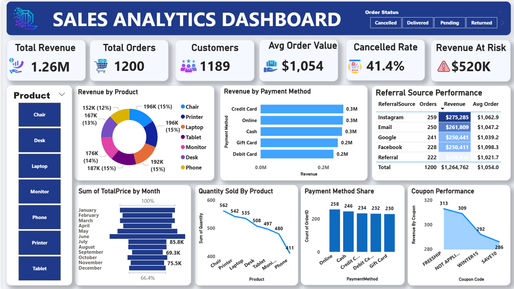

# 📊 Interactive Sales Analytics Dashboard
### Data Analytics Internship — Project 4: Data Visualization | DecodeLabs

> **Turning raw sales numbers into a story anyone can understand in 5 seconds.**

This repository contains my fourth and final project from my **Data Analytics Internship at DecodeLabs**. It's an interactive **Power BI dashboard** that takes a messy pile of e-commerce order data and turns it into a clean, single-screen report that answers the questions a business owner actually cares about *"How much did we sell? Who's buying? What's going wrong, and where's the money we're losing?"*


---

## 🧠 What This Project Is

Imagine a company sells products online. Every order who bought it, what they bought, how they paid, whether it was cancelled, gets logged in a spreadsheet. On its own, that spreadsheet is just thousands of rows of numbers. **Nobody in a boardroom has time to read a spreadsheet.**

My job in this project was to act like a translator: take that raw spreadsheet and turn it into a **single-page visual dashboard** that a busy executive could glance at for five seconds and immediately understand:
- How much money the business is making
- Who its customers are
- Which payment methods and products are performing best
- How much revenue is being lost to cancellations and returns
- Where new customers are coming from

This isn't just "made some charts." It's about **data storytelling** deliberately choosing *what* to show, *how* to show it, and *what conclusion* the viewer should walk away with.

---

## 🎯 Why This Project Exists

This was **Project 4** of a 4-part internship track at DecodeLabs, and it was framed as an *"Optional Mastery Phase"*  meaning it wasn't required to pass the internship, but it proved a deeper skill: the ability to **communicate data insights visually**, the way a real data analyst does for company leadership (not just for other analysts).

The official goal given for the project was:

> *"Create visual representations of data to communicate insights clearly."*

With three core requirements:
- Build charts (bar, line, pie/donut, etc.)
- Choose the **right** chart for each type of data not just a pretty one
- Highlight the key insight, not just display numbers

---

## 🛠️ Tools & Technologies Used

| Tool | Purpose |
|---|---|
| **Microsoft Power BI Desktop** | Building the interactive dashboard, data modeling, and DAX measures |
| **Power Query** | Cleaning and transforming the raw dataset before analysis |
| **DAX (Data Analysis Expressions)** | Writing custom calculations like Average Order Value and Revenue at Risk |
| **Canva** | Designing the accompanying project brief/training deck |

> 💡 *In simple terms: Power BI is like Excel's more powerful cousin it connects to data, lets you clean it up, and turns it into interactive charts you can click, filter, and explore.*

---

## 📂 About the Data

The dashboard runs on a single, cleaned dataset called `Cleaned_Dataset`, representing individual e-commerce orders. Here's what each piece of information means in plain terms:

| Column | What It Means (Plain English) |
|---|---|
| `OrderID` | A unique ID number for every order placed |
| `CustomerID` | A unique ID for every customer, used to count how many *different* people bought something |
| `Product` | The item that was purchased |
| `Quantity` | How many units were bought in that order |
| `TotalPrice` | How much money that order was worth |
| `PaymentMethod` | How the customer paid (card, wallet, cash on delivery, etc.) |
| `OrderStatus` | Whether the order was completed, cancelled, or returned |
| `CouponCode` | Whether a discount coupon was used, and which one |
| `ReferralSource` | How the customer found the store (social media, search, referral, etc.) |
| `Date` | When the order was placed |

Before any charts were built, this data was **cleaned** removing duplicate orders, fixing inconsistent labels (e.g., "COD" vs "Cash on Delivery"), and handling missing values because a beautiful chart built on messy data is still a *wrong* chart.

---

## 🎨 The Design Philosophy Behind the Dashboard

This project came with a full **best-practice design brief** (included in this repo as the PDF), and every decision on the dashboard was made using its rules rather than guesswork. Here's the thinking distilled into plain language:

### 1. 🏗️ Choose With Purpose (The Architect)
> *"Never start with your data and ask 'what chart looks good?' Start with the question you want to answer."*

Every chart on the dashboard was picked because it's the **best fit** for the question, not because it looked nice:
- **Comparing categories** (e.g., revenue by payment method) → **Bar chart**
- **Showing a trend** (e.g., revenue over time) → **Line/Funnel chart**
- **Showing parts of a whole** (e.g., revenue by product) → **Donut chart**
- Axes always start at zero, and no 3D or distorted charts are used because a stretched or tilted chart can make a 2% change *look* like a 200% change, which is misleading.

### 2. ✂️ Edit With Precision (The Editor)
> *"If a pixel doesn't help the audience understand the metric, delete it."*

This follows a principle from data-visualization expert **Edward Tufte** called the **Data-Ink Ratio** — basically, "don't decorate, communicate." That's why the dashboard:
- Has no unnecessary gridlines, borders, or background clutter
- Uses **direct labels** on charts instead of forcing the eye to bounce between a chart and a legend
- Uses a **calm, muted color palette** with just **one bold accent color** to highlight the most important number  because if everything is highlighted, nothing is

### 3. 📖 Tell a Story (The Storyteller)
> *"Numbers don't speak for themselves."*

The dashboard is built to be understood using the **"5-second rule"**: an executive should understand the main takeaway within 5 seconds of looking at it, with the most important KPIs placed top-left where the human eye naturally looks first.

---

## 🖥️ Dashboard Walkthrough

The dashboard is a single, information-dense (but uncluttered) page: **1280 × 720**, on a soft light-grey background (`#EEF1F7`) with a bold **"SALES ANALYTICS DASHBOARD"** header banner.

### 📌 Top KPI Cards (the "5-second summary")
Six at-a-glance numbers sit at the top of the report the first thing anyone sees:

| Card | What It Tells You |
|---|---|
| 💰 **Total Revenue** | Total money earned across all orders (sum of `TotalPrice`) |
| 👥 **Unique Customers** | How many *distinct* people have made a purchase (not just order count) |
| 🛒 **Average Order Value** | On average, how much does a customer spend per order? |
| ⚠️ **Cancelled + Returned %** | What percentage of orders never actually became real revenue |
| 📉 **Revenue at Risk** | How much money is tied up in cancelled/returned orders |
| 📦 **Total Orders** | Total number of orders placed |

### 📊 Visual Breakdown

| Chart | Type | What It Shows |
|---|---|---|
| **Revenue by Product** | Donut Chart | Which products are driving the most revenue, as a share of the whole |
| **Payment Method Performance** | Bar Chart | Revenue, average order value, and customer count broken down by how people paid |
| **Order Volume by Payment Method** | Clustered Column Chart | How many orders were placed through each payment method |
| **Revenue Trend by Product** | Line Chart | How revenue and quantity sold for each product move over time |
| **Monthly Revenue Funnel** | Funnel Chart | How revenue is trending month over month |
| **Coupon Code Impact** | Area Chart | How many orders used each discount coupon |
| **Referral Source Breakdown** | Table | Orders, revenue, and average order value by acquisition channel (how customers found the store) |
| **Filters (Slicers)** | Interactive Slicers | Let the viewer filter the *entire* dashboard by **Product** or **Order Status** with a single click |

Because it's a real Power BI report and not a static image, anyone opening it can click a product name or an order status and watch **every chart and KPI on the page update instantly** to reflect just that slice of data.

---

## ❓ Key Business Questions This Dashboard Answers

A good dashboard isn't a pile of charts, it's a set of answers. This one was built to answer:

- 💵 How much revenue are we actually generating?
- 👤 How many real customers do we have, versus just order count?
- 💳 Which payment method brings in the most reliable, highest-value customers?
- 🎯 Which products are our best (and worst) revenue drivers?
- 🚨 How much money are we losing to cancellations and returns and is it a small leak or a serious problem?
- 📈 Is revenue growing, shrinking, or steady month to month?
- 🏷️ Are our discount coupons actually driving order volume, or just cutting into margin?
- 📣 Which marketing/referral channels are bringing in customers?

---

## 💻 How to Open & Use the Dashboard

1. **Install** [Power BI Desktop](https://powerbi.microsoft.com/desktop/) (free, Windows only).
2. **Download** `Project_4_dashboard.pbix` from this repository.
3. **Open** the file in Power BI Desktop it will load with the full interactive report.
4. **Explore**:
   - Click any bar, slice, or line to cross-filter the whole page.
   - Use the **Product** and **Order Status** slicers on the report to zoom into specific segments.
   - Hover over any chart for exact tooltip values.

> 📝 *Don't have Power BI Desktop? You can still review the design brief and this README to understand exactly what the dashboard contains and why each choice was made  and I've included dashboard screenshots below (add your exported images here).*

<!-- 🖼️ Add screenshots of your dashboard here, for example:

-->

---

## 🗂️ Repository Structure

```
📁 sales-analytics-dashboard/
├── 📘 Cleaned_dataset.csv                   
├── 📊 Project 4 dashboard.pbix            
└── 📄 README.md                           
└──    assets
```

---

## 🌱 What I Learned

This project pushed my skills beyond "can I make a chart" into "can I make the *right* chart, for the *right* reason, that leads to the *right* decision." Specifically, I practiced:

- **Choosing chart types deliberately** based on the question being asked, not aesthetics alone
- **Writing DAX measures** to calculate meaningful business metrics (Average Order Value, Revenue at Risk, Cancellation Rate) rather than relying only on raw columns
- **Applying the Data-Ink Ratio principle** to strip out visual clutter ("chartjunk") and keep only what adds understanding
- **Designing for a 5-second first impression**, placing the most important KPIs where the eye naturally lands first
- **Structuring a data narrative** using the Situation → Complication → Resolution (SCR) framework, so the dashboard doesn't just show numbers it tells a story with a conclusion
- **Building interactivity** with slicers so a non-technical stakeholder can explore the data themselves without needing to ask an analyst for a new report every time

---

## 🏢 About DecodeLabs

This project was completed as part of a **Data Analytics Industrial Training** internship track with **DecodeLabs**, an ed-tech/training organization focused on hands-on, portfolio-ready data projects for aspiring analysts.

📍 Greater Lucknow, India
🌐 www.decodelabs.tech
📧 decodelabs.tech@gmail.com

---

## 🔗 Connect With Me

If you'd like to know more about this project or my work as a Data Analyst, feel free to connect:

- **GitHub:** *[https://github.com/ShifaRehan]*
- **LinkedIn:** *[www.linkedin.com/in/shifa-rehan]*
- **Email:** *[shifarehan19@gmail.com]*

---

⭐ *If you found this project interesting, consider giving this repository a star, it helps a lot as I continue building my data analytics portfolio!*
