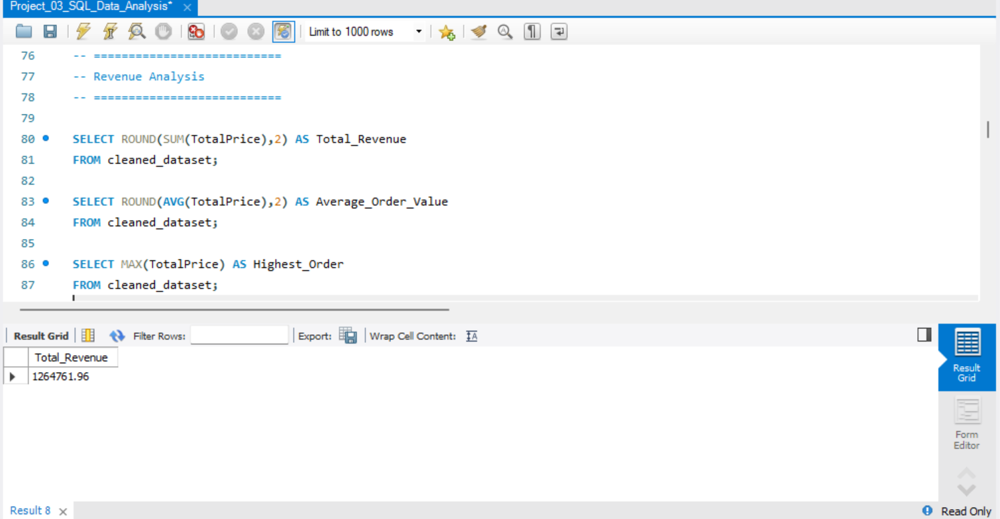
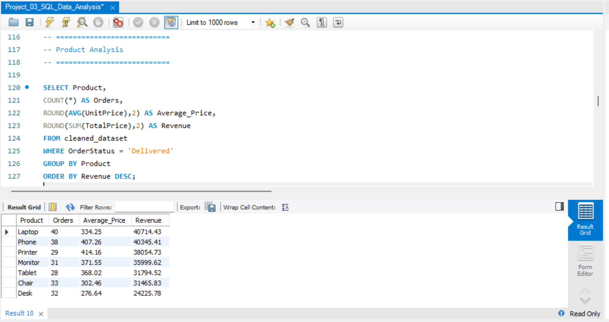
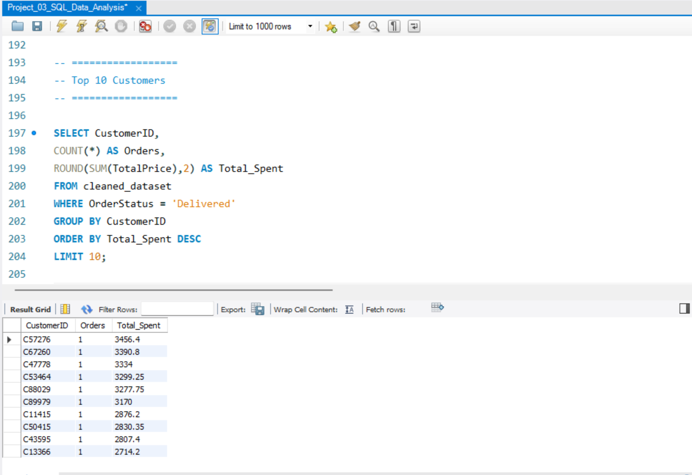
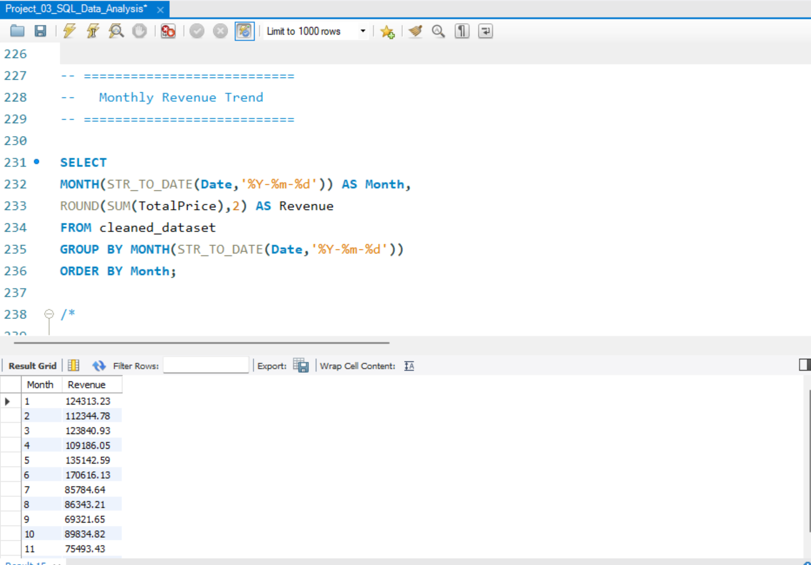

# 🗃️ Project 03: SQL Data Analysis

> **DecodeLabs Data Analytics Internship — Project 03**  
> *Batch 2026 | Industrial Training Kit*


---

# 📖 Project Overview

This project was completed as part of my **Data Analytics Internship at DecodeLabs**.

The objective of this project was to analyze a cleaned e-commerce sales dataset using **Structured Query Language (SQL)** and extract meaningful business insights that can support data-driven decision-making.

Unlike spreadsheets, SQL enables us to directly communicate with relational databases by filtering, grouping, sorting, and aggregating data efficiently. Throughout this project, I explored customer purchasing behavior, product performance, revenue trends, payment preferences, referral sources, and order status using SQL queries.

Rather than simply displaying data, this project focuses on **asking business questions and answering them with SQL**.

---

# 🎯 Project Objectives

The main objectives of this project were to:

- Explore and understand the dataset
- Validate data quality
- Calculate important business metrics
- Analyze revenue and sales performance
- Evaluate product performance
- Identify customer purchasing behavior
- Analyze payment methods
- Examine referral source effectiveness
- Identify repeat customers
- Generate actionable business insights using SQL

---

# 🧠 Understanding SQL Execution Flow

Although SQL queries are written in one order, the database executes them in a different sequence.

```text
 FROM / JOIN
      ↓
    WHERE
      ↓
   GROUP BY
      ↓
    HAVING
      ↓
    SELECT
      ↓
   ORDER BY
```

Understanding this execution order is essential for writing efficient and optimized SQL queries.

---

# 🛠️ Tools & Technologies Used

| Tool | Purpose |
|------|---------|
| MySQL Workbench | Database Management |
| SQL | Data Querying & Analysis |
| GitHub | Version Control & Documentation |

---

# 📂 Dataset Information

| Attribute | Details |
|-----------|----------|
| Dataset | Cleaned E-commerce Sales Dataset |
| Database | sales_db |
| Table | cleaned_dataset |
| Total Orders | 1,200 |
| Unique Customers | 1,189 |

---

# 🧩 SQL Concepts Applied

Throughout this project, I practiced and implemented the following SQL concepts:

| SQL Concept | Description |
|-------------|-------------|
| SELECT | Retrieve required data |
| WHERE | Filter rows |
| GROUP BY | Group similar records |
| HAVING | Filter grouped data |
| ORDER BY | Sort query results |
| DISTINCT | Retrieve unique values |
| COUNT() | Count records |
| SUM() | Calculate totals |
| AVG() | Calculate averages |
| MAX() | Highest value |
| MIN() | Lowest value |
| ROUND() | Format numerical values |
| LIMIT | Restrict returned rows |
| LIKE | Pattern matching |
| Aggregate Functions | Business metric calculations |

---

# 🔄 Project Workflow

The project followed a structured data analysis workflow:

```
Database Setup
      ↓
Data Exploration
      ↓
Data Quality Assessment
      ↓
Business Statistics
      ↓
Revenue Analysis
      ↓
Product Analysis
      ↓
Customer Analysis
      ↓
Payment Method Analysis
      ↓
Order Status Analysis
      ↓
Referral Source Analysis
      ↓
Coupon Code Analysis
      ↓
Monthly Revenue Analysis
      ↓
Business Insights & Recommendations
```

---

# 📊 Analysis Performed

## 🔍 1. Data Exploration

Understanding the dataset before beginning the analysis.

**Tasks Performed**

- Displayed sample records
- Examined table structure
- Reviewed column names and data types

---

## 🧹 2. Data Quality Assessment

Verified the dataset before analysis.

**Tasks Performed**

- Checked missing values
- Validated important fields
- Ensured data consistency

---

## 📈 3. Business Statistics

Calculated key business metrics including:

- Total Orders
- Unique Customers
- Total Products
- Highest Order
- Lowest Order
- Average Order Value
- Total Revenue

---

## 💰 4. Revenue Analysis

Analyzed overall business performance by calculating:

- Total Revenue
- Average Revenue
- Revenue Contribution
- Highest Revenue Products

---

## 📦 5. Product Performance Analysis

Analyzed product performance by identifying:

- Most Ordered Products
- Highest Revenue Products
- Average Selling Price
- Average Quantity Sold

---

## 👥 6. Customer Analysis

Identified:

- Top 10 Customers
- Repeat Customers
- Highest Spending Customers

---

## 💳 7. Payment Method Analysis

Evaluated customer payment preferences.

The analysis determined:

- Most Frequently Used Payment Method
- Orders by Payment Type

---

## 🚚 8. Order Status Analysis

Examined business operations through order status.

Status categories included:

- Delivered
- Pending
- Cancelled

This analysis helped identify operational areas requiring improvement.

---

## 📣 9. Referral Source Analysis

Compared different customer acquisition channels.

Metrics included:

- Number of Orders
- Revenue Generated
- Best Performing Referral Source

---

## 🎟️ 10. Coupon Code Analysis

Evaluated promotional campaign effectiveness by analyzing:

- Coupon Usage
- Revenue Generated through Coupons

---

## 📅 11. Monthly Revenue Analysis

Calculated monthly sales trends to identify:

- Highest Revenue Month
- Monthly Sales Distribution

---

# 📌 Key Business Insights

The analysis revealed several important findings:

| Insight | Observation |
|---------|-------------|
| 📦 Total Orders | **1,200 Orders** |
| 👥 Customers | **1,189 Unique Customers** |
| 💰 Total Revenue | **$1,264,761.96** |
| 💵 Average Order Value | **$1,053.97** |
| 🪑 Highest Revenue Product | **Chair** |
| 📱 Highest Average Price | **Phone** |
| 💳 Most Preferred Payment Method | **Online** |
| ❌ Largest Order Status | **Cancelled** |
| 📲 Best Referral Source | **Instagram** |
| 👑 Top Customers | Small group contributed significantly to revenue |
| ⭐ Premium Orders | Orders above $500 indicate strong demand |
| 📅 Highest Revenue Month | **January** |

---

# 💼 Business Recommendations

Based on the findings, the following recommendations can improve business performance:

| Recommendation | Expected Benefit |
|---------------|------------------|
| Reduce order cancellations | Improve customer satisfaction |
| Promote high-performing products | Increase revenue |
| Continue investing in Instagram marketing | Increase customer acquisition |
| Reward repeat customers | Improve customer retention |
| Improve inventory planning | Prevent stock shortages |
| Monitor monthly trends | Better forecasting and planning |

---

# 📁 Repository Structure

```text
Project-03-SQL-Data-Analysis/
│
├── README.md
├── Project_03_SQL_Data_Analysis.sql
├── cleaned_dataset.csv
│
└── screenshots/
    ├── data_exploration.png
    ├── data_quality_check.png
    ├── revenue_analysis.png
    ├── product_analysis.png
    ├── payment_method_analysis.png
    ├── order_status_analysis.png
    ├── referral_source_analysis.png
    ├── customer_analysis.png
    └── monthly_revenue_analysis.png
```

---

# 📷 Project Screenshots

## SQL Queries

Include screenshots of important SQL queries.

```markdown

```

---

## Query Results

Include screenshots of query outputs.

```markdown







```

---

# 🎓 Learning Outcomes

Completing this project strengthened my understanding of:

- SQL Query Writing
- Database Exploration
- Data Filtering & Sorting
- Aggregate Functions
- Business Data Analysis
- Customer Analytics
- Revenue Analysis
- Writing Efficient SQL Queries
- Problem Solving with SQL
- Generating Actionable Business Insights

---

# 🚀 Future Improvements

Future enhancements to this project may include:

- Creating interactive dashboards using Power BI or Tableau
- Connecting MySQL with visualization tools
- Implementing SQL Views and Stored Procedures
- Using Window Functions for advanced analytics
- Automating SQL reports

---

# 🎯 Conclusion

This project demonstrates how SQL can transform raw transactional data into meaningful business insights.

By applying filtering, grouping, aggregation, and sorting techniques, I answered practical business questions related to customer behavior, product performance, sales trends, payment preferences, and marketing effectiveness.

Completing this project significantly strengthened my SQL skills and enhanced my ability to analyze business data using relational databases.

---

# 👩‍💻 Author

## **Shifa Rehan**

**Data Analytics Intern**  
**DecodeLabs**

📅 **Internship Duration:**  
**27 June 2026 – 27 July 2026**

---

## ⭐ Thank You!

Thank you for visiting this repository.

If you found this project interesting or helpful, feel free to explore my other internship projects and connect with me on LinkedIn.

⭐ **Don't forget to check out the rest of my Data Analytics Internship Portfolio!**
